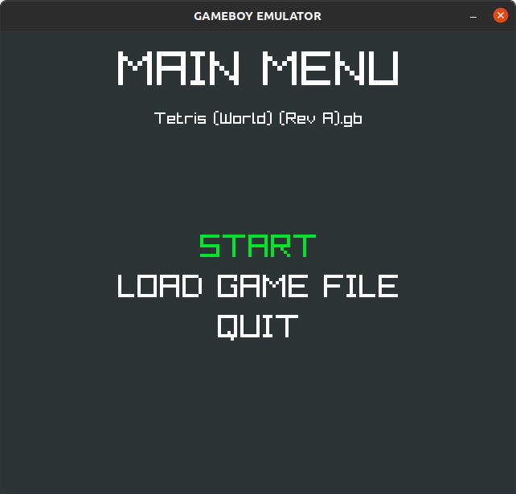

# GameBoy Emulator in RUST
A GameBoy Emulator to learn how emulation works.

# Example
*The Main Menu*

*The Main Menu after the game is chosen*

# Resources
- [GameBoy Pandoc](https://gbdev.io/pandocs/)
- [GameBoy Opcodes](https://www.pastraiser.com/cpu/gameboy/gameboy_opcodes.html)
- [GameBoy list of resources](https://project-awesome.org/gbdev/awesome-gbdev)
# Credits
- [Raylib rs](https://github.com/deltaphc/raylib-rs)